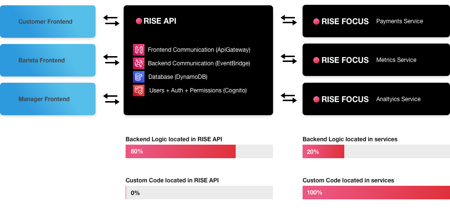

# Rispresso

This project is an implementation of the serverless espresso demo app made by the SAE team for ReInvent 2021. This project demonstrates how to use the following frameworks to build a non trivial application:

-   Rise API
-   Rise FOCUS
-   NextJS

## Architecture

## What RISE API and RISE FOCUS do well

One of the aims of this project is to show why someone would want to use these frameworks. Alot of backend code often amounts to CRUDL boilerplate, resulting in a lot of code that is not unique to your business.

This project demonstrates:

-   RISE API can accomplish most of your business logic without having to write code
-   RISE FOCUS allows you to focus on writing code for what is actually unique to your business
