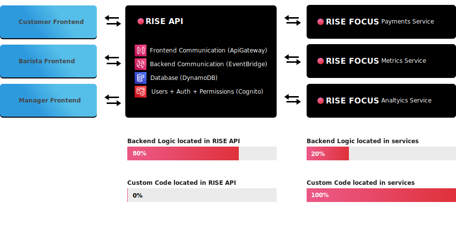

# Rispresso

This project was inspired by the [serverlesspresso](https://github.com/aws-samples/serverless-coffee) demo app made for ReInvent 2021 demonstrating serverless services. This project demonstrates how to use the following frameworks:

-   Rise API
-   Rise FOCUS
-   NextJS

## Architecture

## What RISE API and RISE FOCUS do well

One of the aims of this project is to show why someone would want to use these frameworks. Alot of backend code often amounts to CRUDL boilerplate and defining which users can do what, resulting in a lot of AWS Lambda code that is not unique to your business.

This project demonstrates:

-   RISE API can accomplish a lot of your business logic without having to write lambda code
-   RISE FOCUS allows you to focus on writing lambda code for the unique parts of your application

## Overview of services

### api

API uses the Rise API framework to accomplish most of the application business logic. All additional custom logic in the `service` folders receive events from Rise API

### service-analytics

Uses the Rise Focus framework to setup

-   AWS Firehose
-   AWS S3
-   AWS Glue
-   AWS Athena

to query data in S3 with SQL statements

### service-emailer

Uses the Rise Focus framework to setup lambda functions to send emails via SendGrid

### sevice-metrics

Uses the Rise Focus framework to record custom CloudWatch metrics for customer wait time and creates CloudWatch dashboards for each store

### service-payments

Uses the Rise Focus framework to create placeholder lambda functions for executing payments. (TODO: immplement Stripe)
